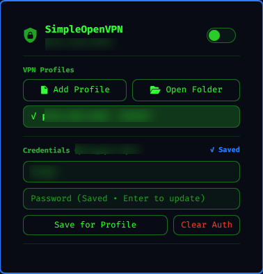

# SimpleOpenVPN

SimpleOpenVPN is an Omarchy bar widget for running a single OpenVPN tunnel from the Omarchy shell. It provides a compact status icon, a profile picker, profile-specific credentials, connect/disconnect controls, live tunnel details, and recent OpenVPN log output.

The plugin is intentionally small: it does not manage NetworkManager VPN profiles, systemd services, or multiple concurrent tunnels. It is built for users who already have `.ovpn` or `.conf` files and want a direct bar control for them.



## Features

- Add `.ovpn` or `.conf` profiles with a graphical file picker
- Remember profiles across restarts
- Save login credentials per profile file
- Connect or disconnect from the bar
- Right-click the bar icon for quick connect/disconnect
- Show active tunnel interface, IPv4 address, and traffic counters
- Show recent OpenVPN log lines inside the panel
- Keep profile state under `~/.local/state`

## Requirements

SimpleOpenVPN is designed for Omarchy and its Quickshell-based shell.

Install these packages before enabling the plugin:

```sh
omarchy pkg add openvpn jq zenity python
```

It also uses tools that are normally present on Omarchy or Arch Linux:

- `pkexec`
- `ip`
- `ps`
- `find`
- `awk`
- `grep`
- `sed`
- `python3`
- GNU coreutils

## Install

Install dependencies:

```sh
omarchy pkg add openvpn jq zenity python
```

Add and enable the plugin:

```sh
omarchy plugin add https://github.com/diogogc/simple-openvpn.git --enable
```

Move it to the right side of the bar if needed:

```sh
omarchy bar move io.github.diogogc.simple-openvpn --section right
```

You can also use the included installer from a checked-out copy:

```sh
./install.sh
```

`omarchy plugin add` does not run plugin install hooks or privileged setup. The installer script is only a convenience wrapper that installs packages first and then calls `omarchy plugin add`.

## Usage

Click the SimpleOpenVPN bar icon to open the panel.

Use **Add Profile** to select an OpenVPN `.ovpn` or `.conf` file. The selected file is remembered as a profile and becomes the active profile.

Enter your VPN username and password, then click **Save for Profile**. Credentials are linked to the selected profile path, so switching profiles also switches the saved credentials.

Use the switch in the panel to connect or disconnect. You can also right-click the bar icon to toggle the VPN without opening the panel.

## Security

SimpleOpenVPN runs inside the unsandboxed Omarchy shell as the desktop user, then uses `pkexec` only for the OpenVPN launch/stop operations that need elevated privileges.

Security hardening in the current implementation was shaped by review from [HANCORE-linux](https://github.com/HANCORE-linux). Their feedback identified command-line credential exposure, predictable shared temporary paths, descriptor/path race conditions, and root OpenVPN execution of user-owned profiles.

The plugin now keeps credentials off process argv, stores profile auth files with private permissions, keeps privileged runtime files under a root-owned `/run` directory, performs descriptor-relative file publication, opens user-supplied files with `O_NOFOLLOW` and `fstat()` validation, and rejects OpenVPN profile directives that would add privileged code execution or control surfaces such as `plugin`, nested `config`, `iproute`, management sockets, script hooks, and runtime output overrides.

References:

- OpenVPN 2.6 manual: https://openvpn.net/community-docs/community-articles/openvpn-2-6-manual.html
- OpenVPN management interface notes: https://openvpn.net/community-docs/management-interface.html
- Omarchy plugin development guide: https://omarchyplugins.com/develop.html
- Omarchy plugin publishing guide: https://omarchyplugins.com/publish.html

## Remove

```sh
omarchy plugin remove io.github.diogogc.simple-openvpn
```

## License

MIT
